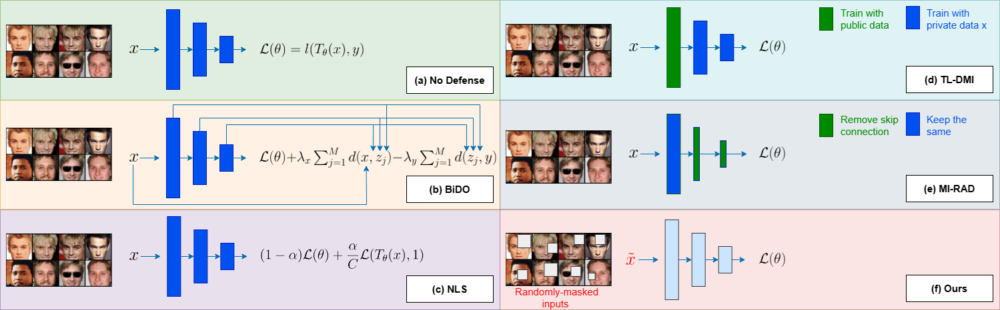

# Random Erasing vs. Model Inversion: A Promising Defense or a False Hope? (TMLR 2025)
Viet-Hung Tran$^*$ , Ngoc-Bao Nguyen$^*$ , Son T. Mai, Hans Vandierendonck, Ira Assent, Alex Kot, Ngai-Man Cheung
$^*$ The first two authors contributed equally.
  

  
  

> **Abstract:**
> *Model Inversion (MI) attacks pose a significant privacy threat by reconstructing private training data from machine learning models. While existing defenses primarily concentrate on model-centric approaches, the impact of data on MI robustness remains largely unexplored. In this work, we explore Random Erasing (RE), a technique traditionally used for improving model generalization under occlusion, and uncover its surprising effectiveness as a defense against MI attacks. Specifically, our novel feature space analysis shows that models trained with RE-images introduce a significant discrepancy between the features of MI-reconstructed images and those of the private data. At the same time, features of private images remain distinct from other classes and well-separated from different classification regions. These effects collectively degrade MI reconstruction quality and attack accuracy while maintaining reasonable natural accuracy. Furthermore, we explore two critical properties of RE including Partial Erasure and Random Location. Partial Erasure prevents the model from observing entire objects during training. We find this has a significant impact on MI, which aims to reconstruct the entire objects. Random Location of erasure plays a crucial role in achieving a strong privacy-utility trade-off. Our findings highlight RE as a simple yet effective defense mechanism that can be easily integrated with existing privacy-preserving techniques. Extensive experiments across 37 setups demonstrate that our method achieves state-of-the-art (SOTA) performance in the privacy-utility trade-off. The results consistently demonstrate the superiority of our defense over existing methods across different MI attacks, network architectures, and attack configurations. For the first time, we achieve a significant degradation in attack accuracy without a decrease in utility for some configurations.*  
[Full Paper (PDF)](https://arxiv.org/abs/2409.01062)

## Model Inversion Defense
  

  
  

